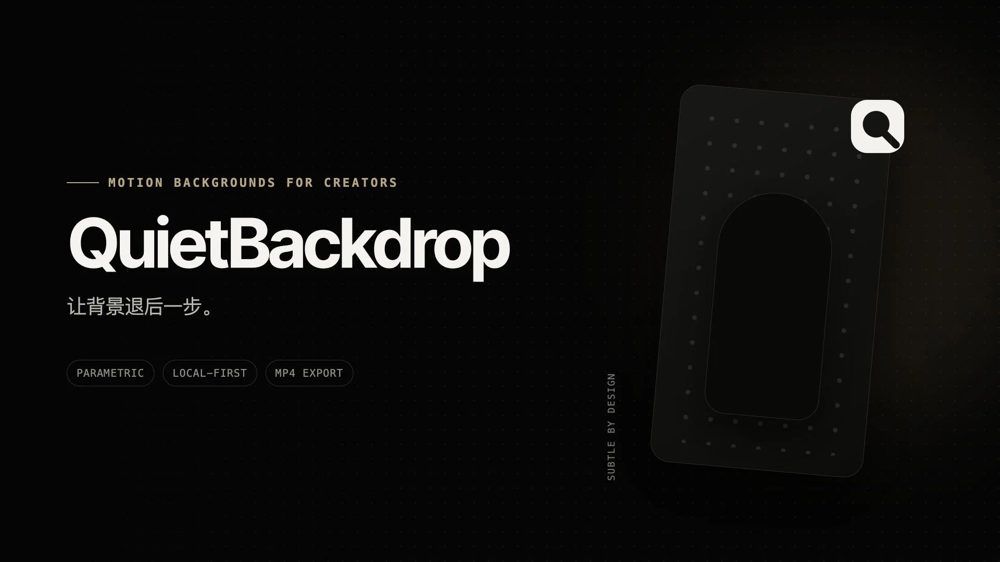
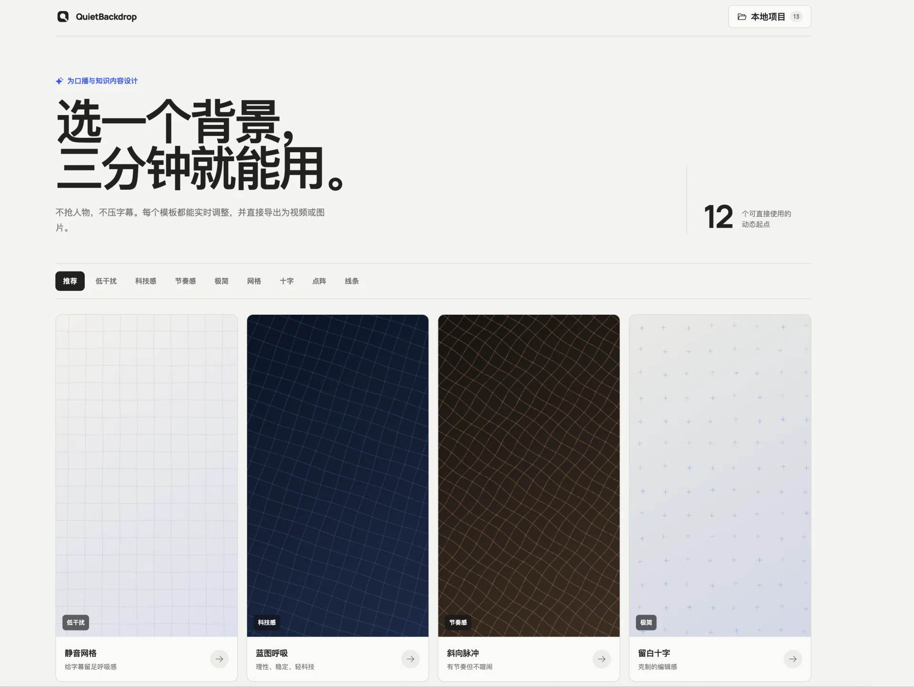
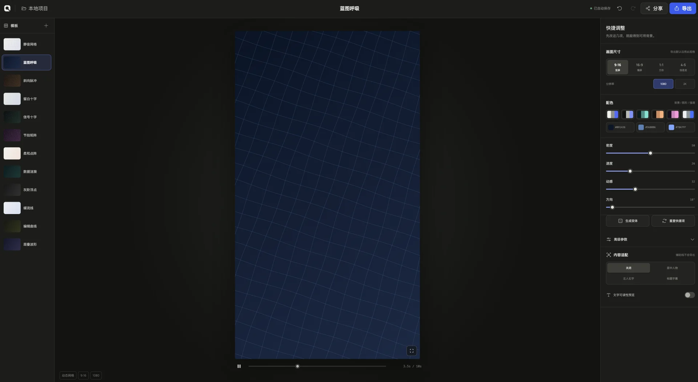

<div align="center">


# QuietBackdrop

**让背景退后一步。**



[](./LICENSE)

**[在线使用 QuietBackdrop →](https://backdrop.suntongxue.me/)**

</div>

QuietBackdrop 是一个本地优先的参数化动态背景生成器。它面向口播、知识分享和观点类视频，帮你在几分钟内做出不抢人物、不压字幕的可导出背景。

它不需要 AI，不上传作品；模板、调参、项目保存和渲染都在浏览器中完成。

## 你会得到什么





- 12 个可直接使用的动态起点，覆盖网格、十字、点阵和流动线条。
- 密度、速度、能量、方向、配色和高级图形参数实时调整。
- `9:16`、`16:9`、`1:1` 和 `4:5` 画幅，支持 PNG、JPEG 和 MP4 导出。
- 桌面端最高支持 2K / 60fps；移动端限制为 1080p / 30fps。
- 本地项目、撤销/重做、JSON 导入导出和可分享链接。

## 快速开始

```bash
git clone https://github.com/sunyifeng11111/quiet-backdrop.git
cd quiet-backdrop
npm install
npm run dev
```

打开终端输出的本地地址，选择一个模板即可进入编辑器。

### 环境要求

- Node.js `^20.19.0` 或 `>=22.12.0`
- 推荐使用最新版 Chrome 或 Edge，MP4 导出依赖浏览器的 AVC 编码、OffscreenCanvas 和 Worker 能力

## 工作方式

QuietBackdrop 将每个背景定义为一组可复现的参数，由 Canvas 实时绘制。导出时，同一渲染器在 Worker 中逐帧生成画面并编码为视频，因此预览与导出保持一致。

项目数据默认只存在浏览器 `localStorage` 中。如需迁移或备份，可在“本地项目”中导出 JSON。

## 开发命令

```bash
npm run dev       # 本地开发
npm run test      # 运行测试
npm run lint      # 代码检查
npm run build     # 生产构建
npm run preview   # 预览生产构建
```

## 贡献

欢迎提交 Issue 和 Pull Request。修改提交前请至少运行 `npm run test` 和 `npm run lint`。

## 许可证

[MIT](./LICENSE) © 2026 [sunyifeng11111](https://github.com/sunyifeng11111)

## 关于作者

**孙同学玩AI**

| 平台 | 账号 |
| --- | --- |
| 小红书 | 孙同学玩AI |
| 视频号 | 孙同学玩AI |
| 抖音 | 孙同学玩AI |
| 公众号 | 孙同学玩AI |
